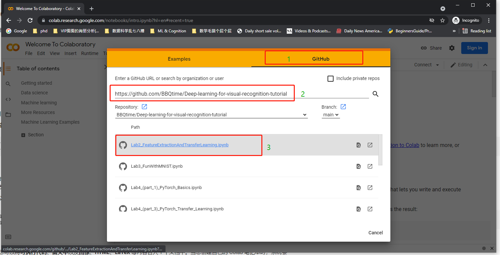

# Deep-learning-for-visual-recognition-tutorial

Aarhus University course

## Google Colab
If you don't have a GPU, Google has provided some free GPU time for small-scale computations. 

Visit https://colab.research.google.com/ and following below instructions to open tutorials from this repository(https://github.com/BBQtime/Deep-learning-for-visual-recognition-tutorial). The experiment data would be downloaded into your google drive space.

 

